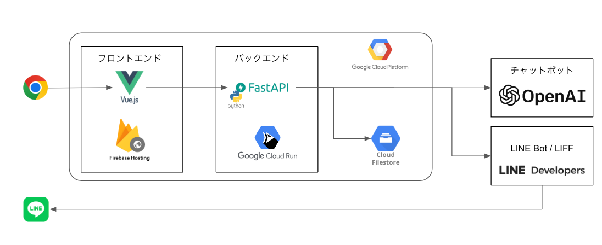

# Myna Safety

マイナポータルハッカソンのバックエンドです。

## 概要

本アプリケーションは下記の URL で起動しています。

- https://myna-safety-backend-r2dn2ftu7a-uc.a.run.app/

API のインターフェースは下記の SwaggerDoc から確認してください

- [Myna Safety Backend API DOCS](https://myna-safety-backend-r2dn2ftu7a-uc.a.run.app/docs)

> **Warning**  
> デモ用のWebサイトのため、上記のエンドポイントは予告なく終了する可能性があります。

全体構成



## Quick Start

## 1. 必要情報の取得

はじめに下記のサービスにアクセスし、利用に必要な情報を取得する

| サービス名 | URL | 必要な情報 |
| --- | --- | --- |
| OpenAI | https://beta.openai.com/ | APIキー |
| LINE Developers | https://developers.line.biz/console/ | Channel Secret, Channel Access Token |
| Google Cloud | https://console.cloud.google.com/ | サービスアカウントキー, バケット名 |
| マイナポータル | ハッカソン期間中のみ利用可能 | APIエンドポイント, APIトークン |

## 2. 環境変数の設定

.env.sampleを参考に、本プロジェクト直下に.envのファイルを作成する。その後、`1. 必要情報の取得`で取得した情報を、下記の情報を.envに記載する

```sh:
# OpenAI APIのアクセスキー
OPENAI_API_KEY=

# 下記のURLにアクセスし、Messaging APIの利用を開始してください
# https://developers.line.biz/console/
LINE_CHANNEL_SECRET=
LINE_CHANNEL_ACCESS_TOKEN=

# マイナAPIのサンプル用のエンドポイントとトークンを指定してください
MYNA_API_URL=
MYNA_API_TOKEN=

# Google Cloudのサービスアカウントキーのパス
CRED_PATH="./app/key/credential.json"
# Google Cloud Storageのバケット名
GOOGLE_CLOUD_STORAGE_BUCKET_NAME=

# 画像が投稿されてない時のデフォルトのThumbnail画像のパス
LINEBOT_ENTRY_FORM_REQUEST_THUMBNAIL_URL=
```

## 2. サーバの起動

はじめに仮想環境と必要ライブラリをインストーする。

```sh:
poetry install
```

単体テストを実行し、正常に動作することを確認する

```sh:
poetry run pytest .
```

その後、下記のコマンドでサーバーを起動する

```sh:
poetry run uvicorn app.main:app --host 0.0.0.0 --port 8080 --reload
```

実行後、下記の URL にアクセスし、SwaggerDocs が表示されることを確認する

- http://localhost:8080/docs